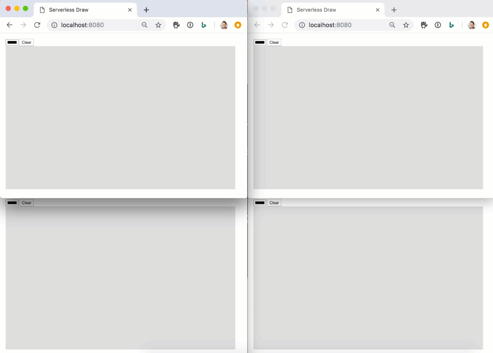

# Serverless Draw - Azure Functions with Azure SignalR Service (JavaScript, C#, Java)


### [View all Roadmaps](https://github.com/nholuongut/all-roadmaps) &nbsp;&middot;&nbsp; [Best Practices](https://github.com/nholuongut/all-roadmaps/blob/main/public/best-practices/) &nbsp;&middot;&nbsp; [Questions](https://www.linkedin.com/in/nholuong/)
<br/>



## Java

```bash
cd src/java
cp local.settings.sample.json local.setting.json
# Update local.setting.json with SignalR Service connection string
mvn clean package -DskipTests
mvn azure-functions:run
```

## JavaScript

```bash
cd src/javascript
cp local.settings.sample.json local.setting.json
# Update local.setting.json with SignalR Service connection string
func extensions install
func start
```

## C\#

```bash
cd src/csharp
cp local.settings.sample.json local.setting.json
# Update local.setting.json with SignalR Service connection string
func start
```

# 🚀 I'm are always open to your feedback.  Please contact as bellow information:
### [Contact ]
* [Name: nho Luong]
* [Skype](luongutnho_skype)
* [Github](https://github.com/nholuongut/)
* [Linkedin](https://www.linkedin.com/in/nholuong/)
* [Email Address](luongutnho@hotmail.com)


[](https://ko-fi.com/nholuong)

# License
* Nho Luong (c). All Rights Reserved.🌟